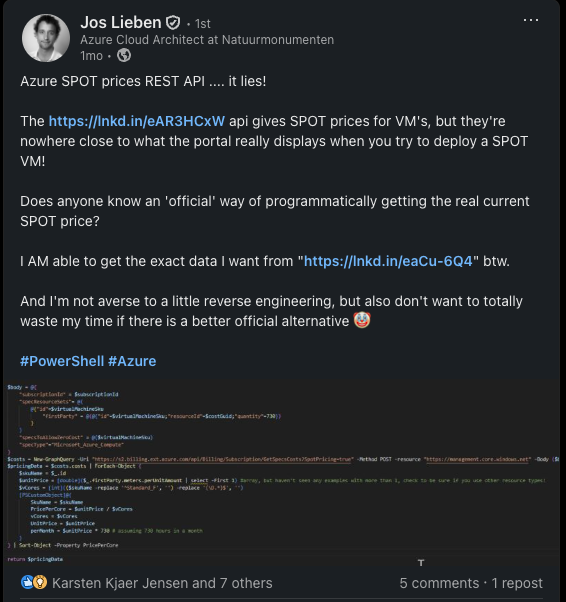
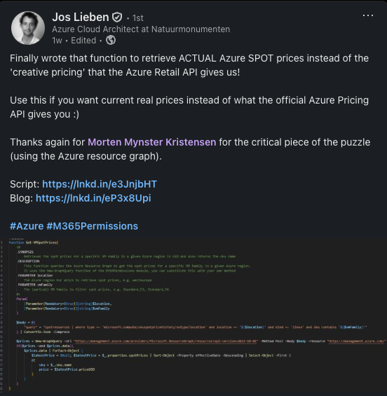

Recent example of something where the data you receive is not always correct example that Jos Lieben showed off:



Microsoft docs referes to this link

*<https://prices.azure.com/api/retail/prices>*

looking at the docs

*<https://learn.microsoft.com/en-us/rest/api/cost-management/retail-prices/azure-retail-prices>*

Now if we look at a specific one like this one "Standard_D2ds_v5" the price is set to 0.272 USD per hour of compute but i can tell for the primary region i use as of writing this there is a v6 available which is not even in the list

```json
{
  "currencyCode": "USD",
  "tierMinimumUnits": 0,
  "retailPrice": 0.272,
  "unitPrice": 0.272,
  "armRegionName": "uaecentral",
  "location": "AE Central",
  "effectiveStartDate": "2021-11-01T00:00:00Z",
  "meterId": "001fa4dd-bbe2-5502-b172-8a1af70ea8b8",
  "meterName": "D2ds v5",
  "productId": "DZH318Z08MC5",
  "skuId": "DZH318Z08MC5/0169",
  "productName": "Virtual Machines Ddsv5 Series Windows",
  "skuName": "Standard_D2ds_v5",
  "serviceName": "Virtual Machines",
  "serviceId": "DZH313Z7MMC8",
  "serviceFamily": "Compute",
  "unitOfMeasure": "1 Hour",
  "type": "Consumption",
  "isPrimaryMeterRegion": true,
  "armSkuName": "Standard_D2ds_v5"
}
```

Unfortunately as Jos found out the mismatch between the official documentation and what is opserved in the portal is diffrent so he had a look at the restmethods shown in developer tools (at least that is what i believe he did) and found the url:

*<https://s2.billing.ext.azure.com/api/Billing/Subscription/GetSpecsCosts?SpotPricing=true>*

which Microsoft themself is using when showing you the price in the gui
Our price for "Standard_D2ds_v6"  will be: *0.02347 USD per hour*
This does show the correct priccing and is a completely valid way of getting the cost for the resource.

But another thing that the gui also uses when getting the data for prices - is that it makes a batch request to Resource graphg explorer

*"<https://management.azure.com/providers/Microsoft.ResourceGraph/resources?api-version=2021-03-01>"*

and runs this query

```sql
spotresources
| where type =~ "microsoft.compute/skuspotevictionrate/location"
| where name endswith "/westeurope"
| project props = parse_json(properties)
| project skuName = props.skuName, evictionRate = props.evictionRate
| where isnotempty(skuName) and isnotempty(evictionRate)
```

Now that lets us know that within resource graph explorer there is a table somewhere called spotresources that contains some information about "skuspotevictionrate" and from my experience Microsoft will in 95% of instances try and store related data in either a similar fashion or a similar location in this case both of those is true as within resource graph explorer we have the following 3 sub tables within "spotresources"

- skualternativespotvmsize
- skuspotevictionrate
- skuspotpricehistory

now back to the prices we have this table *"skuspotpricehistory"* which shows all history of spot prices and the history will always contain the latest entries from a quick glans at the data most of the entries only have 1 history element but in some instances they will have more so you will have to select the latest one your self.

And if we try and ruun this query to get the spot price for *"Standard_D2ds_v6"*

```sql
spotresources
| where type == "microsoft.compute/skuspotpricehistory/ostype/location"
| where location == "westeurope"
| where sku contains "D2ds_v6"
```

we will have 2 results one with the kind linux which will be the spot price for linux and hybrid benefits enabled and one for windows where that is the price without hybrid benefit.

- Linux: *0.023468 USD*
- Windows: *0.037958 USD*

And that is the solution presented recently by Jos aswell


If there is time for it another neat/nice table within this one is "resources" which will give you a complete overview of all resources that you are able to view in your tenant so if you ever needed a complete list of all automation accounts in your tenant without having to go over every subscription you could run a query like this one

```sql
resources
| where type == "microsoft.automation/automationaccounts"
```

in my test tenant that would retrun 3 diffrent qutomation accounts that is located all in the same subscription but in diffrent resource groups.
Unfortunately i only have 1 subscription in this tenant so you will have to take my word for it.

References:

- Jos first post

  <https://www.linkedin.com/posts/joslieben_powershell-azure-activity-7353514410256080897-bPZI?utm_source=share&utm_medium=member_desktop&rcm=ACoAACHMLkMB23fOg-wqKD9C0uIVe252G5cWi9Y>

- Jos solution post:

  <https://www.linkedin.com/posts/joslieben_azure-m365permissions-activity-7362099467614855168-P8fp?utm_source=share&utm_medium=member_desktop&rcm=ACoAACHMLkMB23fOg-wqKD9C0uIVe252G5cWi9Y>
